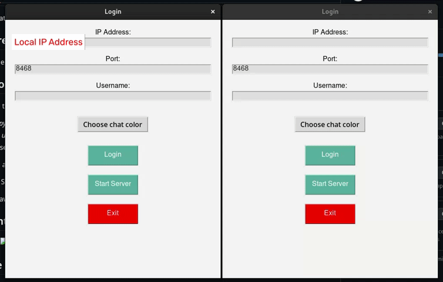

# SimpleChat

SimpleChat is a basic chat application built with Python and Tkinter.

## Features

- Simple chat application on the same local network.

## How to Use

1. Open terminal in the program directory
- Run: *python main.py*
- Enter *username* and *Local IP address*
- Start server
2. Open another terminal session
- Redo Step 1 but instead Join server
3. Chat away!

## Current Progress

## Future Improvements
- Dark Mode
- Chatting on internet
